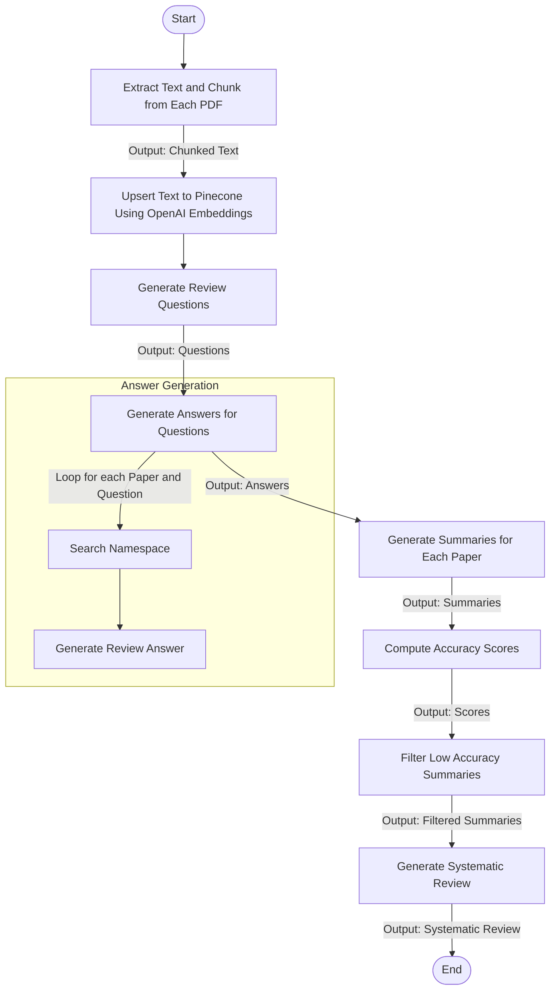

```mermaid
graph TD
    Start([Start]) --> ExtractText[Extract Text and Chunk from Each PDF]
    ExtractText --> |Output: Chunked Text| UpsertText[Upsert Text to Pinecone Using OpenAI Embeddings]
    UpsertText --> GenerateQuestions[Generate Review Questions]
    GenerateQuestions -->|Output: Questions| GenerateAnswers[Generate Answers for Questions]

    subgraph AnswerGeneration[Answer Generation]
        GenerateAnswers -->|Loop for each Paper and Question| SearchNamespace[Search Namespace]
        SearchNamespace --> GenerateReviewAnswer[Generate Review Answer]
    end

    GenerateAnswers -->|Output: Answers| SummarizeAnswers[Generate Summaries for Each Paper]

    SummarizeAnswers -->|Output: Summaries| EvaluateAccuracy[Compute Accuracy Scores]
    EvaluateAccuracy -->|Output: Scores| FilterSummaries[Filter Low Accuracy Summaries]

    FilterSummaries -->|Output: Filtered Summaries| GenerateReview[Generate Systematic Review]
    GenerateReview -->|Output: Systematic Review| End([End])
```